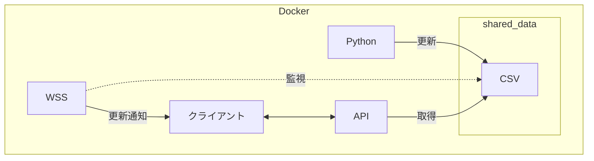

# IO21-06

## 目次
- [システム構成](#システム構成)
- [概要](#概要)
- [セットアップ](#セットアップ)
- [起動方法](#起動方法)
- [仕様](#仕様)

## システム構成
- [Docker](https://www.docker.com/ja-jp/ 'Docker Home')
- [Next.js](https://nextjs.org/ 'Next.js Home')
- Python
- WebSocket ( 以下 WSS )

## 概要
本システムは、Docker 上で動作する Python スクリプト・WebSocket サーバ・Next.js クライアントが
共有データ（CSV）を介して連携する仕組みを提供する。

Python が CSV を更新すると、WSS が変更を検知してクライアントへ通知し、
Next.js の API 経由で最新データを取得・表示する。



## セットアップ
### 本体更新
```bash
apt update
apt upgrade -y
```
### Docker インストール
```bash
curl -fsSL https://get.docker.com | sudo sh
# sudo なしで docker を使いたい場合
sudo usermod -aG docker $USER
# ※ ログアウトして再ログイン、または再起動

# 確認
docker compose version
```

### GitHubからzipファイル取得
```bash

```

## 起動方法

## 仕様