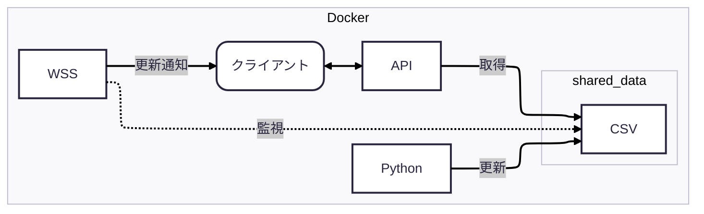
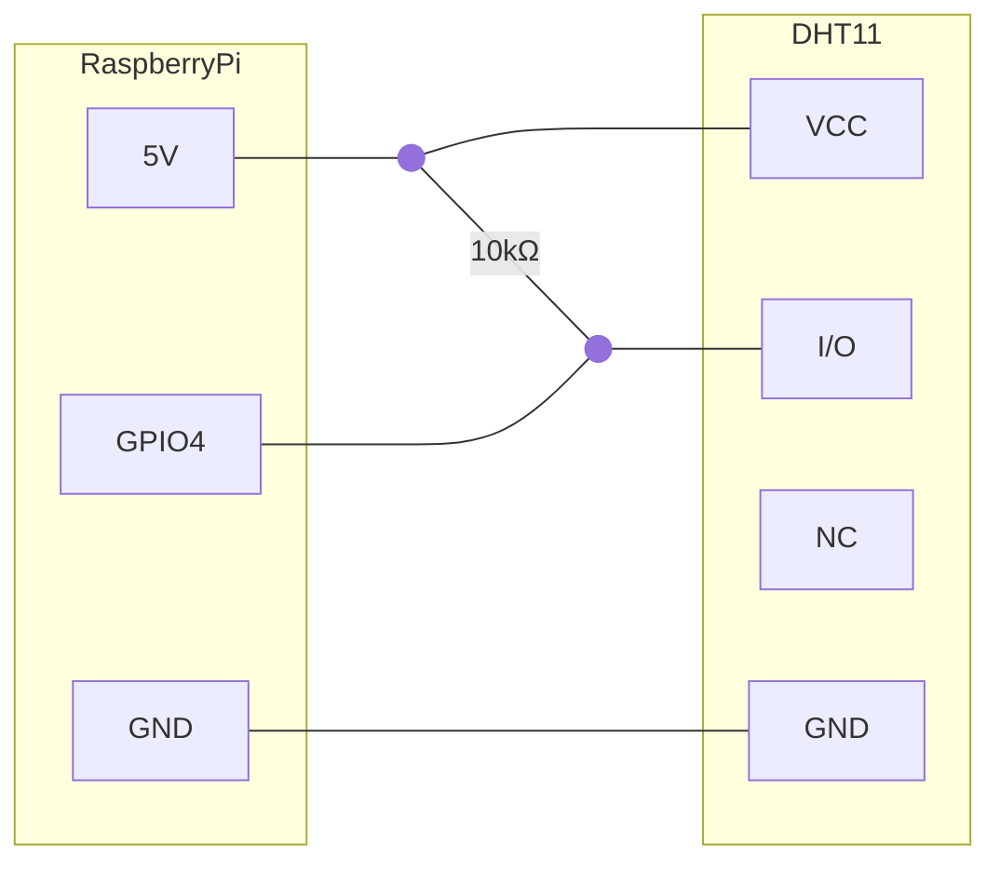

# IO21-06
## 目次
- [システム構成](#システム構成)
- [概要](#概要)
- [セットアップ](#セットアップ)
- [起動と停止、その他](#起動と停止、その他)
## システム構成
- [Docker](https://www.docker.com/ja-jp/ 'Docker Home')
- [Next.js](https://nextjs.org/ 'Next.js Home')
- Python
- WebSocket ( 以下 WSS )
## 概要
本システムは、Docker 上で動作する Python スクリプト・WebSocket サーバ・Next.js クライアントが共有データ（CSV）を介して連携する仕組みを提供する。Python が CSV を更新すると、WSS が変更を検知してクライアントへ通知し、Next.js の API 経由で最新データを取得・表示する。

## セットアップ
### 本体更新
```bash
apt update
apt upgrade -y
```
### Docker インストール
```bash
curl -fsSL https://get.docker.com | sudo sh
# sudo なしで docker を使いたい場合
sudo usermod -aG docker $USER
# ※ ログアウトして再ログイン、または再起動

# 確認
docker compose version
```
### GitHubからzipファイル取得
```bash
wget -L https://github.com/RyOkEeeesh/io21/releases/latest/download/kadai06.zip
# zip解凍
unzip kadai06.zip
```
### raspi と DHT11 の接続
[DHT11データシート](https://akizukidenshi.com/goodsaffix/DHT11_20180119.pdf)をもとに、以下の図のように接続。
> [!NOTE]
> 本システムはGPIO4を使用しているが、変更したい場合は 
>
> **kadai06/py/script.py**
> ```python: kadai06/py/script.py
> instance = dht11.DHT11(pin=4)
> ```
> の、4を任意の値に直す必要がある。

### Dockerのビルド
```bash
cd kadai06
docker compose build
# ※ raspiだと10分くらいかかる
```
## 起動と停止、その他
### 起動
ログ表示あり
```bash
docker compose up
```
ログ表示なし、バックグラウンド起動
```bash
docker compose up -d
```
### 停止
```bash
docker compose down
```
### Dockerの削除
すべての不要なデータを削除
```bash
docker system prune -af
```
